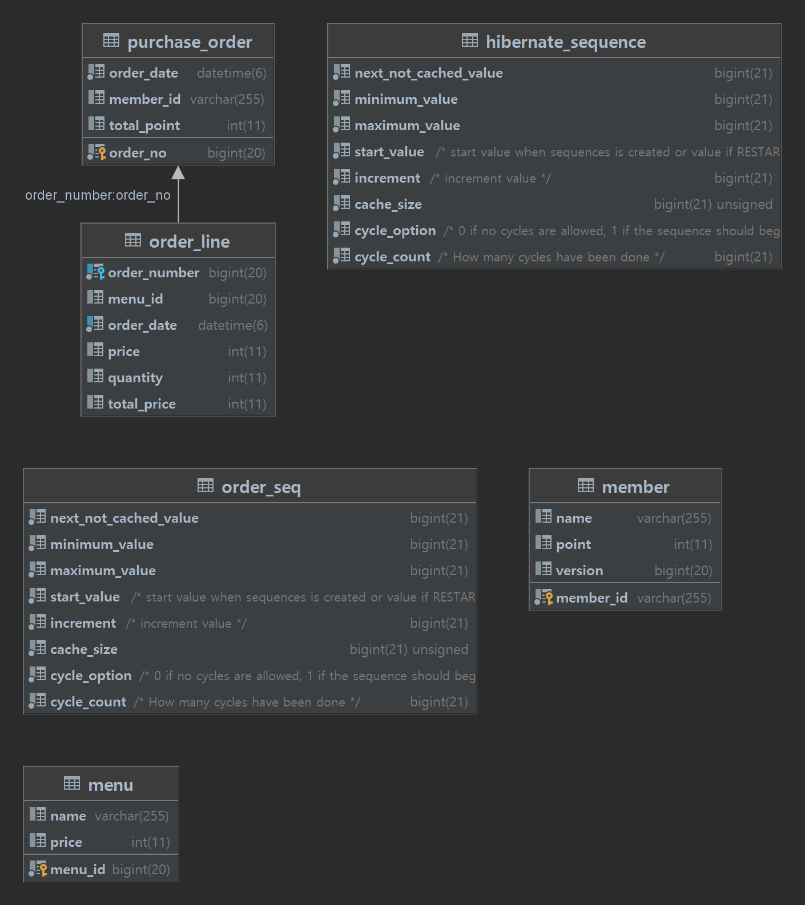

# coffee order system

카카오페이 서버 개발과제인 커피 주문 시스템입니다.

## 시스템 요구사항

- java17 이상의 jvm 환경이 필요합니다.
- local, test, default - embedded redis, h2 (oracle mode)
- production - redis, oracle


## 실행 방법


#### local
./mvnw spring-boot:run -D"spring-boot.run.profiles"=local

### default
./mvnw spring-boot:run

### test
./mvnw test

### production (오라클 및 redis 설정 필요)
./mvnw spring-boot:run -D"spring-boot.run.profiles"=prod
## API 구조

#### member-controller
> PUT /api/members/point (회원의 포인트를 충전)
#### request body
- id : 회원ID
- money : 충전금액
- name : 회원 이름
#### response body
- id : 회원ID
- name : 회원 이름
- point : 현재 포인트
```
curl -X PUT "http://localhost:8080/api/members/point" -H "accept: */*" -H "Content-Type: application/json" -d "{\"id\":\"010-3354-5349\",\"money\":\"1000\",\"name\":\"daniel Kim\"}"
요청 body 예시
{
  "id": "010-3354-5349",  
  "money": "1000",        
  "name": "daniel Kim"    
}
응답 예시
{
  "id": "010-3354-5349",  
  "name": "daniel kim",   
  "point": 146000         
}
```

#### menu-controller
>GET /api/menus/{id} (메뉴 id를 기준으로 메뉴 정보 조회 API)
#### path variable
- id : 메뉴 ID
#### response body
- id : 메뉴ID
- name : 메뉴 이름
- point : 메뉴 가격(point)
```
curl -X GET "http://localhost:8080/api/menus/1" -H "accept: */*"
응답 예시
{
  "id": 1,
  "name": "americano",
  "price": 3500
}
```
>GET /api/menus/best-menus (최근 7일간 인기있는 메뉴 3개를 조회하는 API )
#### response body
- data : 인기 메뉴 리스트
  - menuId : 메뉴ID
  - menuName : 메뉴이름
  - ranking: 인기 랭킹
  - orderCount : 조회 건에 대한 주문 횟수
- count : 인기 리스트 사이즈
```
curl -X GET "http://localhost:8080/api/menus/best-menus" -H "accept: */*"
응답 예시
{
  "data": [
    {
      "menuId": 3,
      "menuName": "latte",
      "ranking": 1,
      "orderCount": 15
    },
    {
      "menuId": 1,
      "menuName": "americano",
      "ranking": 2,
      "orderCount": 8
    },
    {
      "menuId": 2,
      "menuName": "ice americano",
      "ranking": 3,
      "orderCount": 4
    }
  ],
  "count": 3
}
```
#### order-controller
> POST /api/orders/single_order (메뉴 단건 주문 API)
#### request parameter
- member_id : 회원 ID
- menu_id : 메뉴 ID
#### response body
- orderer : 회원 ID
- payment : 지불 포인트
- order_no : 주문 No
- remaining_points : 회원의 남은 포인트
```
curl -X POST "http://localhost:8080/api/orders/single_order?member_id=010-3354-5349&menu_id=1" -H "accept: */*" -d ""
응답 예시
{
  "orderer": "010-3354-5349",
  "payment": 3500,
  "order_no": 3,
  "remaining_points": 142500
}
```
- POST /api/orders/order (메뉴 복수 주문 API)
#### request body
- order_line_list : 주문 리스트
  - menu_id : 메뉴 ID
  - price : 메뉴 가격(point)
  - quantity : 주문량
- orderer : 주문 회원 ID
#### response body
- orderer : 회원 ID
- payment : 지불 포인트
- order_no : 주문 No
- remaining_points : 회원의 남은 포인트
```
curl -X POST "http://localhost:8080/api/orders/order" -H "accept: */*" -H "Content-Type: application/json" -d "{\"order_line_list\":[{\"menu_id\":1,\"price\":3500,\"quantity\":4},{\"menu_id\":2,\"price\":4000,\"quantity\":2},{\"menu_id\":4,\"price\":3000,\"quantity\":1}],\"orderer\":\"010-3354-5349\"}"
요청 body 예시
{
  "order_line_list": [
    {
      "menu_id": 1,
      "price": 3500,
      "quantity": 4
    },
    {
      "menu_id": 2,
      "price": 4000,
      "quantity": 2
    },
    {
      "menu_id": 4,
      "price": 3000,
      "quantity": 1
    }
  ],
  "orderer": "010-3354-5349"
}
응답 예시
{
  "orderer": "010-3354-5349",
  "payment": 25000,
  "order_no": 4,
  "remaining_points": 117500
}
```

## 테이블 관계도



## 고려사항 및 설계 포인트

1. DDD 방법론을 고려하여 프로젝트를 구성하였습니다. 도메인은 크게 (member(회원), order(주문), menu(메뉴)) 로 나누었습니다.
2. CQRS 패턴을 적용하여 도메인 안에 변경 작업이 있는 command 와 쿼리 조회 용도인 query로 로직을 분리했습니다. 이에 따라 Read 및 Write용 DB 분리가 수월해집니다.
3. 회원 ID는 전화번호라는 전제조건을 정했습니다.
4. 캐시솔루션 Redis 적용하여 menu 도메인에 대한 query 부분을 캐싱하는 설정을 적용했습니다. 이를 통해 대규모 트래픽이 몰릴 때 응답 속도를 효과적으로 개선할 수 있습니다. 
5. 데이터 수집 플랫폼으로 실시간 전송하는 로직은 Spring에서 제공하는 event 처리 기능을 적용하여 비동기 처리하였습니다. 그 이유는 해당 수집 로직을 동기로 처리하였을 시 데이터 수집 플랫폼의 응답 시간에 따라 전체 웹 어플리케이션의 응답속도가 늘어나기 때문입니다. 
6. 데이터는 UI에서 API 서버에서 가져온 데이터를 기준으로 요청하는 것을 기준으로 했습니다. 다른 API 서버의 이기종 데이터는 고려하지 않았습니다. 
7. swagger ui를 통해 api의 명세서를 한 번에 보기 쉽게 하고 또한 테스트하기 수월하게 했습니다.  
8. 에러처리, 에러코드는 Spring에서 제공하는 Advice 기능을 이용하여 처리하였습니다.( GlobalExceptionHandler )
9. DI 및 의존성 역전 패턴을 통해 객체간 관계를 느슨하게 하여 유지보수하기 좋은 코드를 작성했습니다.


## TBD 및 개선점

1. 결제 API의 스펙 상세 정의 및 테스트
2. 불필요한 패키지 및 코드 polish
3. Docker를 통한 컨테이너 배포